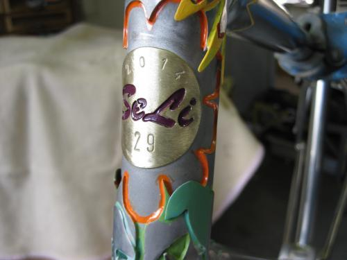
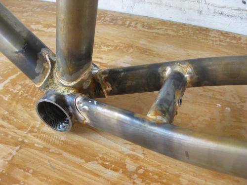

# Edelstahl

#### Rahmen:

* ein Rahmen aus stainless steel, Reynolds 953 oder KVAStainless MS3, startet bei 1800,-€
* dieser ist gemufft oder muffenlos gebaut, nur mit Silber gelötet
* hat ein BSA Tretlager,
* Canti oder Disc Aufnahmen
* ein Paar Flaschenhalterösen  

#### Optionen:

* innenverlegte Züge: 150,-€/Zug
* Coupler für Riementrieb 125,-€
* SeLi Positiv Logo 200 €/Seite
* Custom Ausfaller (s.SeLi 26),Tretlager (s.SeLi 5), ... ab 380,-€
* Slider Ausfaller ab 150,-€
* dreilagig laminierter Steuerkopf (s.SeLi 29) ab 1000,-€  - je nach Aufwand mehr oder weniger (1", 11/8", 44er oder ein 34/44, also 11/8" auf 11/2")  der Fantasie sind hier kaum Grenzen gesetzt - überrascht mich !

#### Pinion:

* ein Pinion Rahmenset in stainless gibt es für 3800,-€, mit dieser Brücke, PinionGetriebe 18 Gang  (blau, schwarz, silber), incl. Drehgriff (Farbe frei wählbar), Kurbeln (170 oder 175mm, schwarz, forged), Spider (LK104) oder KB (24,30Z.)
* andere Getriebe Farben machen 100,-€ Aufpreis, ebenso andere Kurbellängen bzw. CNC Kurbeln (180mm - 155mm in 5mm Schritten)
* Kurbeln für FAT BIKES kosten 200,-€ mehr.
* eine P 1.12 macht 100,-€ Differenz
* eine P 1.9 XR kostet 150,-€ weniger
* bei einer P 1.9 CR werden 200,-€ abgezogen
* mit allen Zugführungen für Schaltung und Bremse
* ausgelegt für Kettentrieb
* Optionen  
  
eine solche Aufnahme (mit oder ohne Ständerplatte) kostet 450,-€ extra.

#### Anhänger:

* aus Edelstahl starten bei 2000,-€
* alles Custom, Ein-oder Zweiachser, Kupplungen siehe bei SeLi 3 bzw. 29

#### Vorbauten:

* ab 380,-€
* Exemplare wie bei SeLi 13 liegen da bei 650,-€

#### Gabeln und Gepäckträger
* ab 500,-€

# Stahl

Hauptsächlich verwende ich Rohre von Columbus und Reynolds. Aber auch andere Hersteller (Tange,...) kommen zum Einsatz.

#### Rahmen:

* ein Rahmen mit ZONA, 631 oder Prestige JPN Geröhr startet bei 900,-€
* Im Wasserbad vom Flussmittel gesäubert, mit geschnittenen/gefrästen Gewinden/Lagersitze, also Stahl pur, OHNE Lack.
* Ihr könnt an diesen Rahmen alles nötige montieren um ein Fahrrad damit entstehen zu lassen:
* Tretlager BSA/ITA in 68/70/73/83er BB
* Steuerrohr 1";1 1/8"; 44mm Semi Int.
* Disc, Canti oder U-brake
* ein Paar Flaschenhalter Ösen
* gemufft oder fillet brazed 
* Zugführungen für Bremse und Ketten-Schaltung
* Dies gilt auch für "Fixie" Rahmen ohne Bremsen und Schaltung - Dafür wird er an anderer Stelle hübscher...
* Ein Steuerkopfschild  

#### Optionen:

* Alle Fillet brazed Nähte sauber verschliffen 300 €
* Slider Ausfallenden ab 70 €
* Coupler für Riemen 125 €
Custom Ausfaller siehe SeLi 25/26  ab 350 €
* Excenter (only Bushnell) Tretlager 100 € ,
* PINION Aufnahme oder Excenter gemufft ab 370 €
* höher wertigere Rohrsätze ca. 5-20 € pro Rohr
* innenverlegte Züge 130 € pro Zug

* laminierte Rohre und Custom Lugs Call
* SeLi Logo als Positiv pro Seite in V2A, mit 120er Korn verschliffen 80 €, andere Schriftzüge plus 15 € pro Buchstabe
* einfarbige Pulverbeschichtung 175 €
* hier nicht aufgeführt?? - ANRUFEN oder MAILEN

#### Pinion

* Ein Rahmen incl. Getriebe 18Gang (silber,schw.,blau), Kurbeln (schwarz,170 oder175mm, forged), Drehgriff (eine von 9 Farben), KB oder Spider;  mit allen Zugführungen für Bremse und Schaltung, für Kettentrieb, ab 3000,- €  Optionen wie Riemen, Slider, etc.siehe oben..., die dabei verbaute Pinionaufnahme seht Ihr hier:  

* Andere Pinionbrücken (SeLi 29) gegen Aufpreis und Absprache möglich, oder demnächst im Anhang ersichtlich...
* andere Getriebe Farben machen 100,-€ Aufpreis, ebenso andere Kurbellängen bzw. CNC Kurbeln (180mm -155mm in 5er Schritten)
* Für FAT BIKE Kurbeln (nur 175mm!) macht es 200,-€ Aufpreis
* eine P 1.12 (12Gang) macht 100,- Differenz
* eine P 1.9 XR  macht 150,-€ weniger
* bei einer P1.9 CR werden 200,-€ abgezogen                                                    

#### Gabeln und Gepäckträger:
* starten bei 350,-€

#### Vorbauten:
* starten bei 250,-€

#### Anhänger:

* Ein- oder Zweiachser, Kupplungen siehe bei SeLi 3 oder 29, Aufbauten und Abmaße alles nach Kundenwunsch...
* ab 1000,-€

