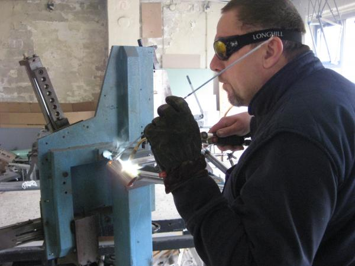
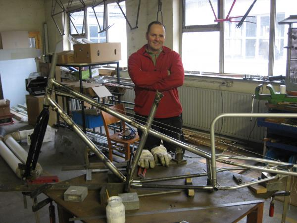
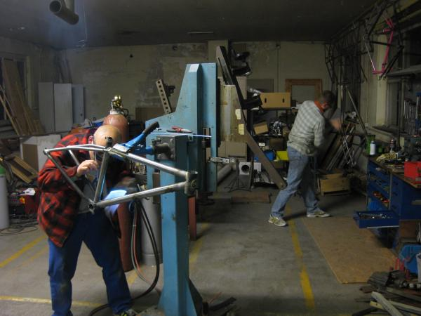

# Kurse

Ein 5 tägiger Kurs kostet 650,-€ + Material (ab 200,-€ für Rahmen ohne Gabel). Eine Verlängerung um den Samstag kostet 50,-€ Aufpreis. Ein Doppel-WE-Kurs incl. einem Sonntag kostet 700,-€ , ein weiterer Sonntag macht 100,-€ Aufpreis.

Es dürfen viele Modelle gebaut werden, außer Tandems und Fullies. Also wäre auch ein Kinderrad, Cargobike (Lastenrad) oder eine Gabel möglich.

"gemufft oder fillet brazed" (ein Cargobike evtl. auch geschweißt)

Wann ? - bestimmt in der Regel der/die Teilnehmer. Maximal aber 2 Kandidaten gleichzeitig.

Da unser zu Hause noch nicht fertig eingerichtet ist, nenne ich für eine Zeltübernachtung (incl. Frühstück und warmer Dusche) 15,-€. Für jede weitere Mahlzeit (2-3 Gänge incl. Getränke) 10,-€.  Es darf natürlich auch auswärts gewohnt und/oder gegessen werden.

Die Minimum Anzahlung von 300,-€ wird nicht zurückerstattet.

Auf Euer Kommen freut sich

**Sebastian Lindler**
