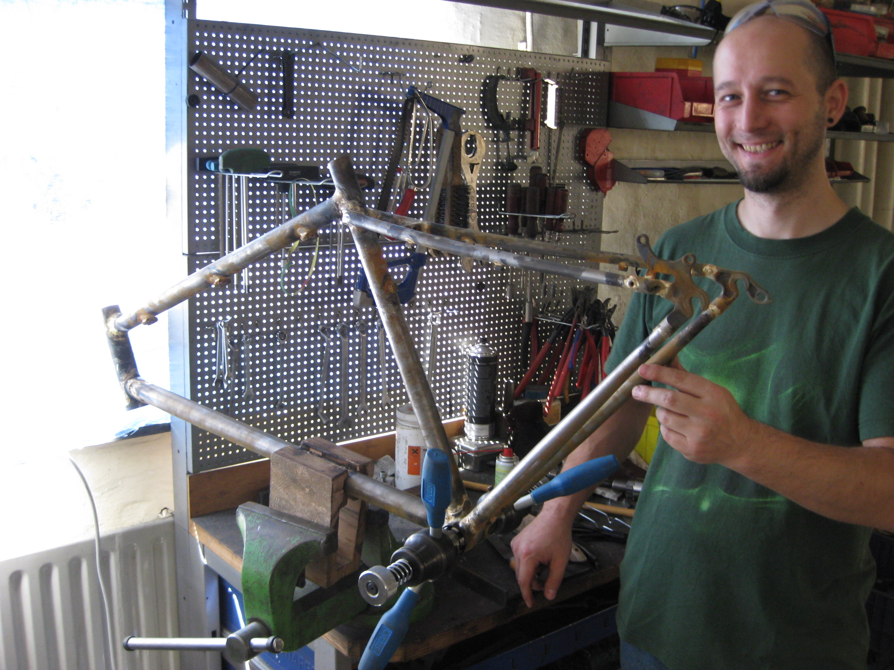

# Kurse
Ein 5-tägiger Kurs kostet 1350€ incl. Material (für einen rohen Rahmen
ohne Gabel). Eine Verlängerung um den Samstag macht 100€ Aufpreis.

Eine passende GAbel zum Maßrahmen kann parallel im Kurs gebaut werden
(ab 350€)
Es dürfen viele Modelle gebaut werden, außer Tandems, Fullys und
Edelstahlrahmen.
...gemufft oder fillet brazed...

Wann? Das bestimmt in der Regel der/die Teilnehmer. Maximal aber 2
Teilnehmer gleichzeitig.

Eine Übernachtung bei uns ist für 35€ pro Nacht möglich (incl. Frühstück
und Gästebad)
Jede weitere Mahlzeit kostet 10€ (2-3 Gänge incl. Getränke).
Es darf natürlich auch auswärts gewohnt und/oder gegessen werden.
Die minimum Anzahlung von 350€ wird nicht zurück erstattet.

Auf Euer Kommen freut sich

*Sebastian
SeLi*
