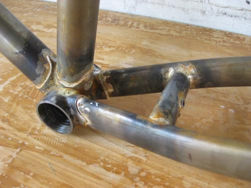
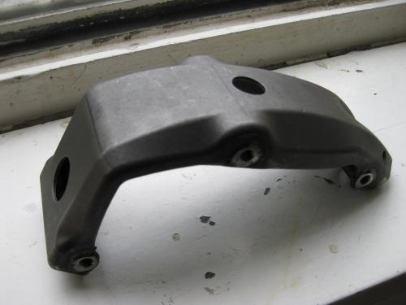

# Stahl

Hauptsächlich verwende ich Rohre von DEDACCIAI, aber auch andere Hersteller wie Columbus und Reynolds kommen zum Einsatz.

#### Rahmen:

* ein Rahmen startet bei 1350,-€
* Im Wasserbad vom Flussmittel gesäubert, mit geschnittenen/gefrästen Gewinden/Lagersitze, also Stahl pur, OHNE Lack.
* Ihr könnt an diesen Rahmen alles nötige montieren um ein Fahrrad damit entstehen zu lassen:
* Tretlager BSA/ITA in 68/70/73/83er BB
* Steuerrohr 1";1 1/8"; 44mm Semi Int.
* Disc, Canti oder U-brake
* ein Paar Flaschenhalter Ösen
* gemufft oder fillet brazed 
* Zugführungen für Bremse und Ketten-Schaltung
* Dies gilt auch für "Fixie" Rahmen ohne Bremsen und Schaltung - Dafür wird er an anderer Stelle hübscher...
* Ein Steuerkopfschild  

#### Optionen:

* Alle Fillet brazed Nähte sauber verschliffen 300 €
* Slider Ausfallenden ab 70 €
* Coupler für Riemen 175 €
* innenverlegte Züge 150 € pro Zug
* hier nicht aufgeführt?? - ANRUFEN oder MAILEN

#### Pinion

* Ein Rahmen incl. Getriebe 18Gang (silber,schw.,blau), Kurbeln (schwarz,170 oder175mm, forged), Drehgriff (eine von 9 Farben), KB oder Spider;  mit allen Zugführungen für Bremse und Schaltung, für Kettentrieb, ab 3000,- €  Optionen wie Riemen, Slider, etc.siehe oben..., die dabei verbaute Pinionaufnahme seht Ihr hier:  

* andere Getriebe Farben machen 100,-€ Aufpreis, ebenso andere Kurbellängen bzw. CNC Kurbeln (180mm -155mm in 5er Schritten)
* Für FAT BIKE Kurbeln (nur 175mm!) macht es 200,-€ Aufpreis
* eine P 1.12 (12Gang) macht 100,- Differenz
* eine P 1.9 XR  macht 150,-€ weniger
* bei einer P1.9 CR werden 200,-€ abgezogen                                                    

#### Gabeln und Gepäckträger:
* starten bei 350,-€

#### Vorbauten:
* starten bei 250,-€

#### Anhänger:

* Ein- oder Zweiachser, Kupplungen siehe bei SeLi 3 oder 29, Aufbauten und Abmaße alles nach Kundenwunsch...
* ab 1000,-€
