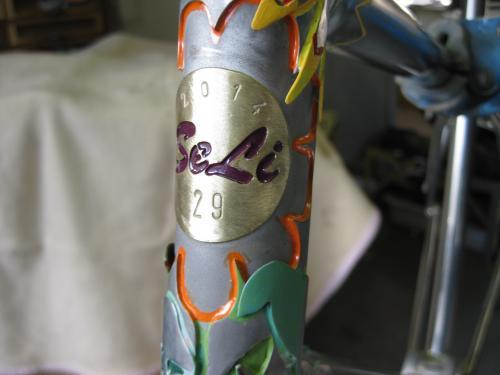

## Edelstahl

#### Rahmen:

* ein Rahmen aus stainless steel, Reynolds 953 oder KVAStainless MS3, startet bei 1800,-€
* dieser ist gemufft oder muffenlos gebaut, nur mit Silber gelötet
* hat ein BSA Tretlager,
* Canti oder Disc Aufnahmen
* ein Paar Flaschenhalterösen  

#### Optionen:

* innenverlegte Züge: 150,-€/Zug
* Coupler für Riementrieb 125,-€
* SeLi Positiv Logo 200 €/Seite
* Custom Ausfaller (s.SeLi 26),Tretlager (s.SeLi 5), ... ab 380,-€
* Slider Ausfaller ab 150,-€
* dreilagig laminierter Steuerkopf (s.SeLi 29) ab 1000,-€  - je nach Aufwand mehr oder weniger (1", 11/8", 44er oder ein 34/44, also 11/8" auf 11/2")  der Fantasie sind hier kaum Grenzen gesetzt - überrascht mich !

## Pinion:

* ein Pinion Rahmenset in stainless gibt es für 3800,-€, mit dieser Brücke, PinionGetriebe 18 Gang  (blau, schwarz, silber), incl. Drehgriff (Farbe frei wählbar), Kurbeln (170 oder 175mm, schwarz, forged), Spider (LK104) oder KB (24,30Z.)
* andere Getriebe Farben machen 100,-€ Aufpreis, ebenso andere Kurbellängen bzw. CNC Kurbeln (180mm - 155mm in 5mm Schritten)
* Kurbeln für FAT BIKES kosten 200,-€ mehr.
* eine P 1.12 macht 100,-€ Differenz
* eine P 1.9 XR kostet 150,-€ weniger
* bei einer P 1.9 CR werden 200,-€ abgezogen
* mit allen Zugführungen für Schaltung und Bremse
* ausgelegt für Kettentrieb
* Optionen  
  
eine solche Aufnahme (mit oder ohne Ständerplatte) kostet 450,-€ extra.
